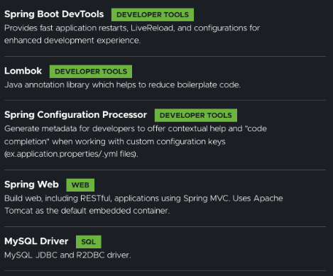

# FictionHouse
## 项目初始化
1. 安装依赖



2. java 17 jdk 17

## 项目配置和框架集成
1. 包结构创建
```
    io
 +- github
     +- xbn   
        +- novel
            +- NovelApplication.java -- 项目启动类
            |
            +- core -- 项目核心模块，包括各种工具、配置和常量等
            |   +- common -- 业务无关的通用模块
            |   |   +- exception -- 通用异常处理
            |   |   +- constant -- 通用常量   
            |   |   +- req -- 通用请求数据格式封装，例如分页请求数据  
            |   |   +- resp -- 接口响应工具及响应数据格式封装 
            |   |   +- util -- 通用工具   
            |   | 
            |   +- auth -- 用户认证授权相关
            |   +- config -- 业务相关配置
            |   +- constant -- 业务相关常量         
            |   +- filter -- 过滤器 
            |   +- interceptor -- 拦截器
            |   +- task -- 定时任务
            |   +- util -- 业务相关工具 
            |   +- wrapper -- 装饰器
            |
            +- dto -- 数据传输对象，包括对各种 Http 请求和响应数据的封装
            |   +- req -- Http 请求数据封装
            |   +- resp -- Http 响应数据封装
            |
            +- dao -- 数据访问层，与底层 MySQL 进行数据交互
            +- manager -- 通用业务处理层，对第三方平台封装、对 Service 层通用能力的下沉以及对多个 DAO 的组合复用 
            +- service -- 相对具体的业务逻辑服务层  
            +- controller -- 主要是处理各种 Http 请求，各类基本参数校验，或者不复用的业务简单处理，返回 JSON 数据等
            |   +- front -- 小说门户相关接口
            |   +- author -- 作家管理后台相关接口
            |   +- admin -- 平台管理后台相关接口
            |   +- app -- app 接口
            |   +- applet -- 小程序接口
            |   +- open -- 开放接口，供第三方调用 

```

2. 通用请求/响应数据格式封装
3. Rest 接口响应工具及响应数据格式封装
4. 通用异常处理